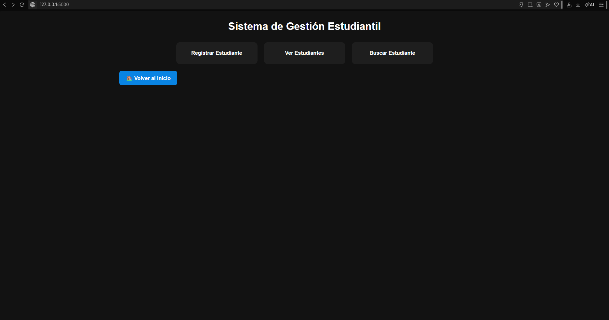
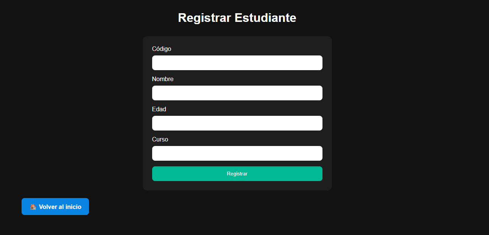
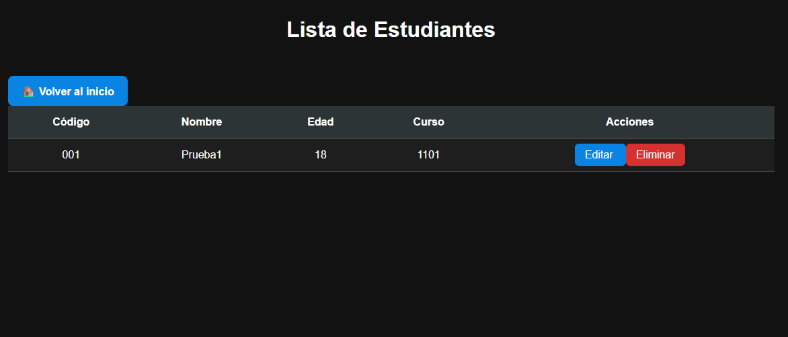
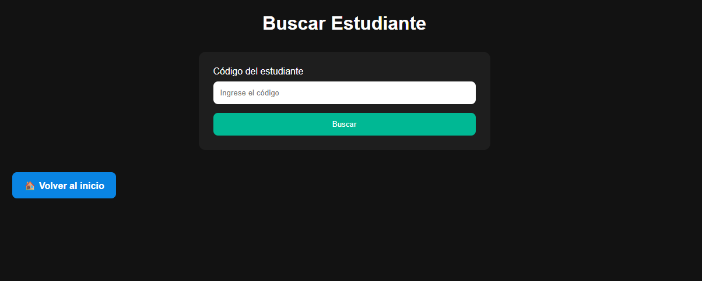

# Sistema de Gestión Estudiantil

Aplicación desarrollada en Python utilizando Programación Orientada a Objetos (POO) y Flask para la gestión de estudiantes mediante una interfaz web moderna.

## Descripción

Este proyecto permite administrar estudiantes mediante operaciones CRUD (Crear, Leer, Actualizar y Eliminar), implementando conceptos fundamentales de Programación Orientada a Objetos como clases, objetos, encapsulación y herencia.

La aplicación cuenta con una interfaz web desarrollada con Flask y almacena la información de forma persistente utilizando archivos JSON.

---

## Características

### Gestión de estudiantes

- Registrar estudiantes
- Mostrar estudiantes
- Buscar estudiantes por código
- Buscar estudiantes por nombre
- Editar estudiantes
- Eliminar estudiantes

### Funciones adicionales

- Ordenar estudiantes por:
  - Nombre
  - Edad
  - Código

- Cantidad total de estudiantes registrados

- Estadísticas:
  - Promedio de edad
  - Edad mayor
  - Edad menor
  - Cantidad de estudiantes

### Persistencia de datos

- Guardado automático en JSON
- Carga automática al iniciar la aplicación

### Validaciones

- Evita códigos duplicados
- Valida edades inválidas
- Evita nombres vacíos
- Evita cursos vacíos

---

## Tecnologías utilizadas

- Python 3
- Flask
- HTML5
- CSS3
- JSON
- Git
- GitHub

---

## Conceptos de POO implementados

### Clase Persona

Clase base que contiene:

- Nombre
- Edad

### Clase Estudiante

Hereda de Persona y agrega:

- Código
- Curso

### Herencia

```text
Persona
   ↑
Estudiante
```

### Encapsulación

Los atributos y comportamientos de cada entidad se encuentran organizados dentro de clases específicas.

---

## Estructura del proyecto

```text
SistemaEstudiantes/
│
├── app.py
├── main.py
├── README.md
├── requirements.txt
├── .gitignore
│
├── modelos/
│   ├── persona.py
│   └── estudiante.py
│
├── servicios/
│   └── sistema.py
│
├── datos/
│   └── estudiantes.json
│
├── templates/
│   ├── index.html
│   ├── registrar.html
│   ├── estudiantes.html
│   ├── buscar.html
│   └── editar.html
│
└── static/
    └── style.css
```

---

## Instalación

Clonar el repositorio:

```bash
git clone https://github.com/TU-USUARIO/TU-REPOSITORIO.git
```

Ingresar al proyecto:

```bash
cd SistemaEstudiantes
```

Crear entorno virtual:

```bash
python -m venv venv
```

Activar entorno virtual:

Windows:

```bash
venv\Scripts\activate
```

Instalar dependencias:

```bash
pip install -r requirements.txt
```

---

## Ejecución

Ejecutar la aplicación:

```bash
python app.py
```

Abrir en el navegador:

```text
http://127.0.0.1:5000
```

---

## Capturas

1.Inicio

2.Apartado Registro

3.Apartado Listado

4.Apartado Buscar Estudiante


---

## Autor

Dilan Chirva

---

## Versión

Versión 2.0

Aplicación migrada desde consola a interfaz web utilizando Flask.
